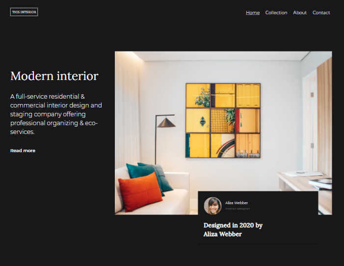

<h1 align="center">{Interior Consultant}</h1>

   Solution for a challenge from  <a href="http://devchallenges.io" target="_blank">Devchallenges.io</a>.

  <h3>
    <a href="https://interior-consultant-c1x393l28-aman-sgz.vercel.app/">
      Demo
    </a>
     | 
    <a href="https://devchallenges.io/solutions/AUkE47DBunB2c3TghCGd}">
      Solution
    </a>
     | 
    <a href="https://devchallenges.io/challenges/Jymh2b2FyebRTUljkNcb">
      Challenge
    </a>
  </h3>

<!-- TABLE OF CONTENTS -->

## Table of Contents

- [Overview](#overview)
  - [Built With](#built-with)
- [Features](#features)
- [Contact](#contact)

<!-- OVERVIEW -->
## Overview
Challenge: Create a homepage following the design. The page should be responsive. 

### Built With

<!-- This section should list any major frameworks that you built your project using. Here are a few examples.-->

- [Sass](https://sass-lang.com/)

## Features

This application/site was created as a submission to a [DevChallenges](https://devchallenges.io/paths/responsive-web-developer) challenge. 
The [challenge](https://devchallenges.io/challenges/Jymh2b2FyebRTUljkNcb) was to build an application to complete the given user stories.

- User story: I can see a page following the given design
- User story: On mobile, I can see a collapsed navigation
- User story: On mobile, when I select the hamburger menu, I can see a navigation

You can see a demo at [Interior consultant](https://interior-consultant-c1x393l28-aman-sgz.vercel.app/)

## Contact

- GitHub [@Aman-sgz](https://github.com/Aman-sgz)
- Twitter [@Aman_arg](https://twitter.com/Aman_arg)

---

  
Aman-sgz 2021

